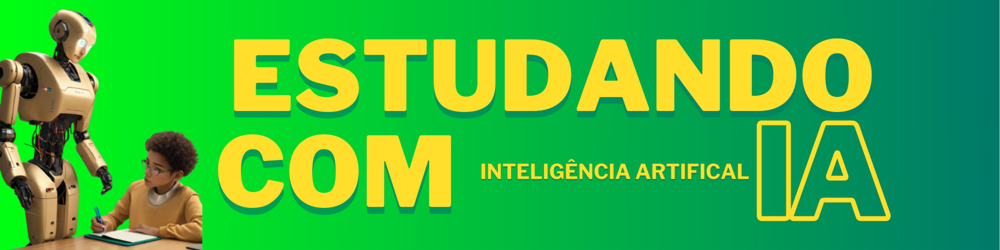

    

-------
# Prévia do artigo:

  

# Projeto artigo técnico gerado por I.A.s

 > ℹ️ **NOTE:** Este é o repositório desenvolvido durante o curso no qual fui aluno na plataforma da [DIO](https://dio.me).

Projeto com o objetivo de gerar um artigo técnico com um layout rico, leitura agradável e com foco em promover sua autoridade técnica.

<a href="https://web.dio.me/articles/estudando-com-inteligencia-artifical?back=%2Farticles&open-modal=true&page=1&order=oldest" title="View PDF now"> 📕Clique aqui para ler o artigo</a>

## 💻 Tecnologias utilizadas no projeto

- [ChatGPT](https://chat.openai.com/) - para título e conteúdo
- [Lexica.art](https://lexica.art/) - para gerar imagens
- [Canva](https://www.canva.com) - Para formatação de banners e Layouts

## 📄 Prompts e ferramentas

ChatGPT：

|   Ação   | prompt                                                                                                                                                                                                                                                                         |
| :------: | ------------------------------------------------------------------------------------------------------------------------------------------------------------------------------------------------------------------------------------------------------------------------------ |
|  título  | Crie 10 headlines para nomes de artigos sobre o assunto Inteligência Artifical Para Estudar                                                                          |
| conteúdo |  Comporte-se como escritor de artigos tech de IAs e escreva o Artigo atendendo as regras abaixo {REGRAS}> Introdução> Assunto {blocos}> Conclusão> No máximo 5 linhas por blocos de explicação> Me explique de maneira informal, como se eu fosse uma criança de 10 anos> os {blocos} que serão criados estão abaixo:- Estudos de casos e exemplos;- Novas técnicas;- Organização e Planejamento;- Melhoria Contínua;- cite exemplos- faça um call to action para minhas redes sociais- coloque 3 hashtags que façam sentido |

Lexica.art：

- No léxica utilizamos o acervo público de imagens geradas por outras pessoas, os termos de pesquisa que utilizei durante a gravação do conteúdo foram:

  • Student Inteligence Artificial No Background

## ✨ Features

- Conteúdo gerado via ChatGPT
- Imagens do acervo público geradas via Lexica.art

## 📚 Materiais

- prompts utilizados

## 🛠️ Instruções de execução

Utilize os prompts acima nas ferramentas sugeridas para gerar o material base e utilize uma ferramenta de edição de documentos como power point, libreoffice , indesign para diagramação, o passo a passo em vídeo pode ser conferido na plataforma da [DIO](https://dio.me).

## 👨‍💻 Expert

    
    
&nbsp&nbsp&nbspGomaof 
    &nbsp&nbsp&nbsp
    <a href="https://github.com/gomaof/">
    GitHub</a>&nbsp;|&nbsp;
    <a href="www.linkedin.com/in/joaogomess/">LinkedIn</a>
&nbsp;

  

---

⌨️ com 💜 por [Joao Gomes](https://github.com/gomaof)